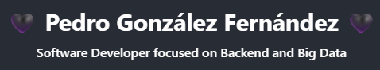

 

  

###

###

 

<h1 align="center">⚙️ Tech Stack ⚙️</h1>

###

 

  
  
  
  
  
  
  
  
  
  
  
  
  
  
  
  
  
  
  
  
  
  
  
  
  
  
  
  
  
  
  
  
  
  
  
  
  
  
  
  
  
  
  
  
  
  
  
  
  
  
  
  
  
  
  
  
  
  
  
  
  
  
  
  
  
  
  
  
  
  
  
  
  
  
  
  
  
  
  
  
  
  
  
  
  
  
  

###

 

<h1 align="center">📊 Stats 📊</h1>

###

 

  
  
  

###

 

  

###

 

  

###